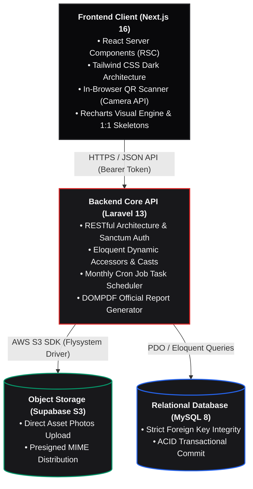

<div align="center">

# SayPraz
### Enterprise Asset Management (EAM), Accounting Ledger & Stock Circulation Platform

[](https://laravel.com)
[](https://nextjs.org)
[](https://supabase.com)
[](https://www.typescriptlang.org/)
[](https://tailwindcss.com/)
[](https://www.mysql.com/)
[](LICENSE)

<p align="center">
  Platform EAM modern berbasis arsitektur <i>Decoupled</i> (Headless API) untuk mengotomatisasi siklus hidup sarana-prasarana: perhitungan depresiasi finansial aset riil (Metode Garis Lurus), pembukuan buku besar otomatis (<i>Double-Entry Journal</i>), tiket perbaikan & kalkulasi TCO, scanner QR kamera web, cetak label massal A4, serta laporan PDF resmi siap audit.
</p>

[Gambaran Proyek](#-gambaran-proyek) •
[Arsitektur Sistem](#-arsitektur-sistem) •
[Siklus Hidup Aset (EAM Lifecycle)](#-siklus-hidup-aset-eam-lifecycle) •
[Mesin Finansial & Akuntansi](#-mesin-finansial--akuntansi) •
[Matriks Hak Akses](#-matriks-hak-akses-rbac) •
[Struktur Basis Data](#-struktur-basis-data) •
[Panduan Instalasi](#-panduan-instalasi)

</div>

---

## Gambaran Proyek

**SayPraz** dirancang untuk mentransformasi tata kelola logistik sekolah dan institusi pendidikan dari pembukuan manual menjadi ekosistem *Enterprise Resource Planning* (ERP) mini yang tangguh. Sistem ini menjawab tantangan utama pengelolaan sarpras:

1. **Discrepancy Fisik & Administratif:** Hilangnya jejak peminjaman dan sirkulasi liar diselesaikan melalui verifikasi QR Code terintegrasi via kamera browser langsung.
2. **Ketiadaan Valuasi Riil & Degradasi Nilai:** Nilai aset tidak lagi statis pada harga beli awal, melainkan terdepresiasi proporsional setiap bulan menggunakan metode akuntansi garis lurus.
3. **Dokumentasi Kerusakan & Beban Biaya:** Rekam jejak servis internal maupun vendor luar dicatat rapi ke dalam tiket kerja (*work orders*), menghitung akumulasi biaya riil kepemilikan aset (*Total Cost of Ownership*).
4. **Audit Finansial Terbuka:** Setiap aksi pelepasan aset (*disposal*) dan servis memicu penerbitan jurnal penutup berimbang (Debit/Kredit) secara otomatis yang siap dicetak ke format PDF berstandar resmi.

---

## Arsitektur Sistem

Platform mengadopsi arsitektur *decoupled* berkinerja tinggi yang memisahkan *presentation layer* modern dengan backend transaksional:



```
[ Pengadaan Aset ]
       │
       ▼
[ Registrasi & Valuasi ] ──────► [ Generate QR Unik ] ───► [ Cetak Satuan / Massal A4 ]
       │                                                              │
       ▼                                                              ▼
[ Operasional Inventaris ] ◄─────────────────────────────── [ Web Camera Scanner ]
   ├─ Tersedia (Available)
   ├─ Dipinjam (Borrowed) ──────► [ Transaksi & Riwayat Pengembalian ]
   ├─ Servis (In Repair) ───────► [ Tiket Perbaikan & Total Cost of Ownership (TCO) ]
   │                                  │
   │                                  ▼
   ├─ Depresiasi Bulanan (Cron) ──► [ Jurnal Beban Penyusutan (Buku Besar) ]
   │                                  │
   ▼                                  ▼
[ Pelepasan Aset (Disposal) ] ──► [ Jurnal Pengakuan Laba / Rugi Pelepasan ]
```

### Penjelasan Modul Inti
* **Kodifikasi & Labeling:** Setiap unit memiliki kode QR unik berformat `AST-{timestamp}-{random}`. Tersedia modul cetak stiker satuan maupun lembar massal A4 (*bulk print*), serta pemindai kamera web langsung untuk verifikasi fisik di lapangan.
* **Pemeliharaan & Work Orders:** Unit yang mengalami kendala dialihkan ke status `in_repair`. Setelah perbaikan selesai, sistem mencatat rincian tindakan, vendor pelaksana, tanggal penyelesaian, dan biaya riil yang langsung terintegrasi ke kalkulasi *Total Cost of Ownership* (TCO) serta pembukuan jurnal akuntansi.
* **Audit Trail Imutabel:** Setiap perubahan status aset dibungkus dalam `DB::transaction` dan otomatis dicatat ke tabel `asset_logs` bersama identitas admin penanggung jawab untuk memastikan integritas rekam jejak.

---

## Mesin Finansial & Akuntansi

SayPraz menerapkan kalkulasi akuntansi aset tetap secara *real-time* dan otomatis di backend:

### 1. Depresiasi Garis Lurus (*Straight-Line Method*)
* **Beban Penyusutan Bulanan ($D_m$):**
  $$D_m = \frac{\text{Harga Perolehan} - \text{Nilai Residu}}{\text{Masa Manfaat (Tahun)} \times 12}$$

* **Akumulasi Depresiasi Berjalan ($AD$):**
  $$AD = \min\Big(D_m \times \text{Bulan Terlewati}, \text{Harga Perolehan} - \text{Nilai Residu}\Big)$$

* **Nilai Riil Buku (Net Asset Value / $NAV$):**
  $$NAV = \max(\text{Nilai Residu}, \text{Harga Perolehan} - AD)$$

---

### 2. Total Cost of Ownership (TCO)
Menghitung biaya kepemilikan unit secara komprehensif:
$$\text{TCO} = \text{Harga Perolehan} + \sum \text{Biaya Perbaikan Selesai}$$

---

### 3. Jurnal Finansial Otomatis (*Double-Entry Bookkeeping*)
Sistem otomatis membukukan transaksi berimbang (Debit/Kredit) pada peristiwa:

* **Perbaikan Aset Selesai:**
  * *Debit:* Beban Pemeliharaan & Perbaikan
  * *Kredit:* Kas / Bank

* **Pelepasan Aset (*Disposal*):**
  * *Debit:* Kas / Bank (Nilai Jual/Lelang)
  * *Debit:* Akumulasi Penyusutan (Penutupan Depresiasi)
  * *Debit/Kredit:* Rugi / Laba Pelepasan Aset Tetap
  * *Kredit:* Aset Tetap (Penghapusan Harga Perolehan Historis)

* **Depresiasi Berkala (Akhir Bulan via *Cron Job*):**
  * *Debit:* Beban Penyusutan Aset Tetap
  * *Kredit:* Akumulasi Penyusutan Aset Tetap

## Matriks Hak Akses (RBAC)

Pemisahan tanggung jawab diatur secara terstruktur melalui sistem peran:

| Fitur / Modul | Administrator | Staf Sarpras | Siswa / Guru |
| :--- | :---: | :---: | :---: |
| **Kelola Master Aset & Kategori** | ✅ Penuh | ❌ Tidak | ❌ Tidak |
| **Tiket Servis & Work Orders** | ✅ Penuh | ✅ Lihat & Buka | ❌ Tidak |
| **Kalkulasi TCO & Depresiasi** | ✅ Penuh | ❌ Tidak | ❌ Tidak |
| **Buku Besar Jurnal & Cetak PDF** | ✅ Penuh | ❌ Tidak | ❌ Tidak |
| **Pelepasan Aset (Disposal)** | ✅ Penuh | ❌ Tidak | ❌ Tidak |
| **Persetujuan Sirkulasi Pinjam** | ✅ Penuh | ✅ Verifikasi | ❌ Tidak |
| **Scanner QR Kamera Web** | ✅ Ya | ✅ Ya | ✅ Ya |
| **Katalog & Pengajuan Pinjam** | ❌ Tidak | ✅ Ya | ✅ Ya |

---

## Struktur Basis Data

Skema database dirancang menggunakan relasi integritas referensial penuh:

```text
categories (1) ────< (N) assets (1) ────< (N) asset_logs (N) >──── (1) users
                           │
                           ├────< (N) transactions (N) >──── (1) users
                           │
                           ├────< (N) maintenances (N) >──── (1) users
                           │
                           └────< (N) financial_journals
```

Panduan Instalasi
1. Kebutuhan Sistem
```
PHP 8.2+ dengan ekstensi PDO, OpenSSL, BCMath, cURL, GD

Node.js 20+ & npm / pnpm

MySQL 8.0+

Composer 2+
```

2. Konfigurasi Backend (Laravel 13)
~~~
# Clone repository
git clone [https://github.com/your-username/saypraz-backend.git](https://github.com/your-username/saypraz-backend.git)
cd saypraz-backend

# Install dependensi PHP
composer install

# Siapkan environment file
cp .env.example .env

# Generate APP_KEY
php artisan key:generate

# Konfigurasikan file .env (Database & Supabase S3 Credentials)
# DB_DATABASE=peminjaman
# AWS_ACCESS_KEY_ID=your_supabase_key
# AWS_SECRET_ACCESS_KEY=your_supabase_secret
# AWS_DEFAULT_REGION=us-east-1
# AWS_BUCKET=assets
# AWS_ENDPOINT=[https://your-project.supabase.co/storage/v1/s3](https://your-project.supabase.co/storage/v1/s3)

# Jalankan migrasi dan seeder
php artisan migrate --seed

# Jalankan development server
php artisan serve
~~~
3. Konfigurasi Frontend (Next.js 16)
~~~
# Pindah ke direktori frontend
cd ../saypraz-frontend

# Install paket JavaScript
npm install

# Siapkan environment client
cp .env.example .env.local

# Sesuaikan endpoint API pada .env.local
# NEXT_PUBLIC_API_URL=http://localhost:8000

# Jalankan server Next.js
npm run dev
~~~

~~~
Aplikasi dapat diakses melalui browser pada http://localhost:3000.
~~~
