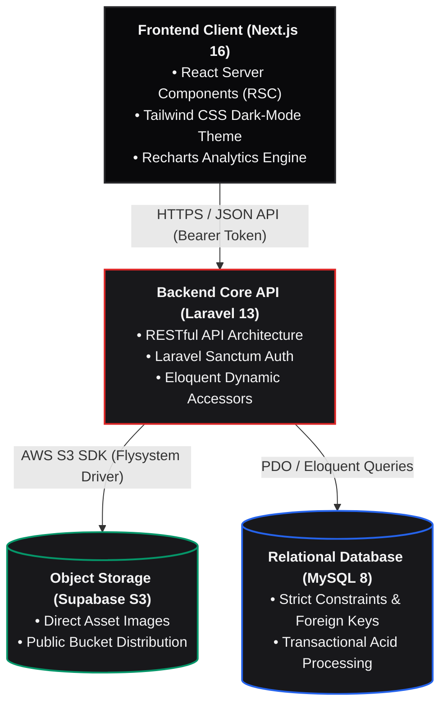

<div align="center">

# 📦 SayPraz
### Enterprise Asset Management (EAM) & Stock Circulation Platform

[](https://laravel.com)
[](https://nextjs.org)
[](https://supabase.com)
[](https://www.typescriptlang.org/)
[](https://tailwindcss.com/)
[](https://www.mysql.com/)
[](LICENSE)

<p align="center">
  Platform EAM modern berbasis arsitektur <i>Decoupled</i> (Headless API) untuk mengotomatisasi siklus hidup sarana-prasarana, perhitungan depresiasi finansial aset riil (Metode Garis Lurus), pelacakan sirkulasi berbasis QR Code, dan rekam jejak audit nir-ubah (<i>Immutable Audit Trail</i>).
</p>

[Gambaran Proyek](#-gambaran-proyek) •
[Arsitektur Sistem](#-arsitektur-sistem) •
[Alur Bisnis & Siklus Aset](#-alur-bisnis--siklus-aset) •
[Mesin Perhitungan Finansial](#-mesin-perhitungan-finansial-eam) •
[Matriks Hak Akses](#-matriks-hak-akses-rbac) •
[Struktur Basis Data](#-struktur-basis-data) •
[Panduan Instalasi](#-panduan-instalasi)

</div>

---

## 📌 Gambaran Proyek

**SayPraz** dirancang untuk mentransformasi tata kelola logistik sekolah dan institusi dari inventarisasi manual menjadi ekosistem digital enterprise. Sistem ini mengatasi tiga masalah krusial:

1. **Discrepancy Fisik & Administratif:** Hilangnya jejak peminjaman (*asset misplacement*) dan peminjaman liar tanpa persetujuan bertingkat.
2. **Ketiadaan Valuasi Riil:** Nilai aset yang tercatat sering kali statis pada harga beli awal, mengabaikan degradasi nilai barang seiring berjalannya tahun pemakaian.
3. **Dokumentasi Kerusakan Minim:** Peralatan fisik mengalami penurunan mutu tanpa adanya catatan rekam jejak perbaikan (*maintenance logs*) yang terpusat.

Dengan menggabungkan konsep **Enterprise Asset Management (EAM)** dan **Sirkulasi Peminjaman Bertingkat**, SayPraz mengawasi aset mulai dari pengadaan (*procurement*), pemanfaatan operasional (*active deployment*), siklus servis (*maintenance*), evaluasi nilai buku berkala, hingga penghapusan unit (*disposal*).

---

## Arsitektur Sistem

Platform mengadopsi arsitektur *decoupled* berkinerja tinggi yang memisahkan *client presentation* dengan backend komputasi transaksional:



```
[ Pengadaan Aset ]
       │
       ▼
[ Registrasi & Valuasi ] ──────► [ Auto-Generate QR Code ] ───► [ Sinkronisasi S3 Media ]
       │
       ▼
[ Operasional Inventaris ] ◄────► [ Mutasi Status & Immutable Audit Trail (AssetLog) ]
   ├─ Tersedia (Available)
   ├─ Dipinjam (Borrowed)
   └─ Perbaikan (In Repair)
       │
       ▼
[ Depresiasi Berkala ] ────────► [ Valuasi Nilai Buku Riil Tiap Tahun Buku ]
       │
       ▼
[ 100% Tersusut ] ─────────────► [ Rekomendasi Disposed / Afkir Barang ]
```
