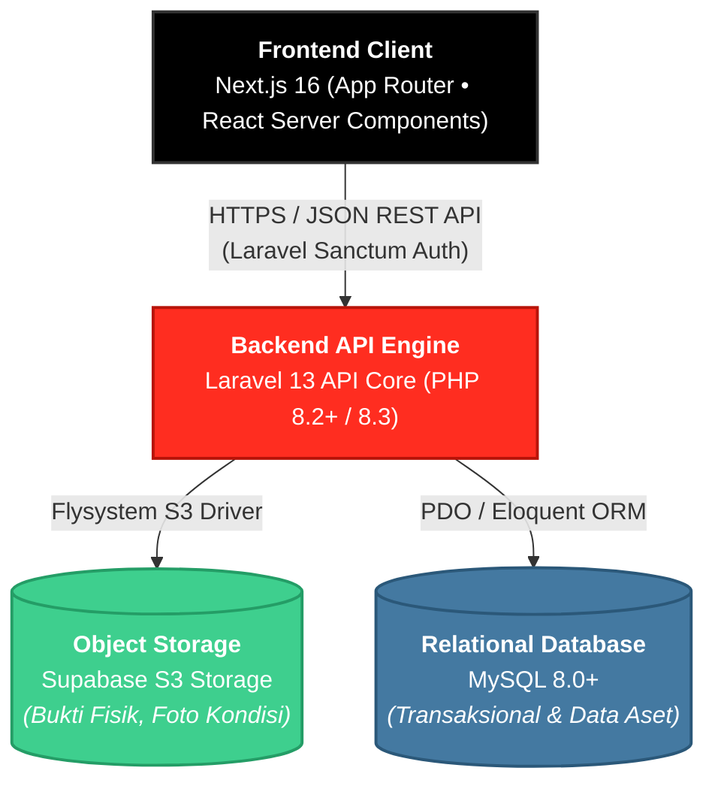

# 📦 SayPraz
### Enterprise Asset Management (EAM) & Stock Circulation Platform

  Platform EAM modern berbasis arsitektur <i>Decoupled</i> untuk mengelola siklus hidup aset, mengontrol perputaran stok peminjaman bertingkat, menginspeksi degradasi fisik, serta menyimpan bukti serah-terima terdesentralisasi via Supabase Storage.

[Gambaran Proyek](#-gambaran-proyek) •
[Fitur Utama](#-fitur-utama) •
[Arsitektur Sistem](#-arsitektur-sistem) •
[Alur Sirkulasi Bisnis](#-alur-sirkulasi-bisnis-business-flow) •
[Struktur Basis Data](#-struktur-basis-data--relasi-entitas) •
[Panduan Instalasi](#-panduan-instalasi) •
[Standar Keamanan](#-standar-keamanan--integritas-data) •
[Lisensi](#-lisensi)

---

## 📌 Gambaran Proyek

**SayPraz** dibangun untuk mengatasi tantangan tata kelola logistik dan inventaris korporat: hilangnya jejak peminjaman (*asset misplacement*), degradasi fisik tanpa dokumentasi inspeksi berkala, serta ketidaksinkronan stok fisik dengan data administratif. 

Menggabungkan konsep **Enterprise Asset Management (EAM)** dengan sistem **Sirkulasi Peminjaman Stok**, SayPraz mengawasi seluruh tahapan aset sejak pengadaan (*procurement*), pemanfaatan operasional (*active deployment*), siklus servis (*maintenance*), hingga penghapusan unit (*disposal*).

---

## 🚀 Fitur Utama

### 1. Manajemen Siklus Hidup Aset (EAM Core)
- **Registrasi Identitas Unik**: Kodefikasi berbasis SKU, serial number, atau *asset barcode/QR tag*.
- **Hierarki Multi-Level**: Klasifikasi barang berdasarkan kategori, gedung, ruangan, rak, dan departemen penanggung jawab.
- **State Machine Kondisi Aset**: Pelacakan status unit secara presisi (`Tersedia`, `Dipinjam`, `Dalam Perbaikan`, `Rusak`, `Dihapus`).
- **Log Pemeliharaan**: Riwayat servis berkala, pencatatan biaya perbaikan (*maintenance cost*), dan teknisi penanggung jawab.

### 2. Sirkulasi & Peminjaman Stok Barang
- **Loan Request Mandiri**: Pengajuan permohonan pinjam oleh pengguna internal dengan batas waktu (*due date*) dan tujuan pemakaian.
- **Multi-Level Approval**: Alur verifikasi dan otorisasi oleh manajer divisi sebelum barang fisik dikeluarkan dari gudang.
- **Handover & Return Inspection**: Verifikasi kondisi barang saat serah-terima versus kondisi pasca-pakai guna mendeteksi kerusakan.
- **Overdue Alert**: Indikator otomatis untuk mendeteksi barang yang melewati tenggat waktu pengembalian.

### 3. Media & Storage Engine (Supabase S3)
- **Asset Media Storage**: Penyimpanan foto katalog dan bukti fisik serah-terima langsung ke bucket Supabase via AWS S3 Client SDK Laravel.
- **Time-Limited Signed URLs**: Pengamanan berkas sensitif (seperti bukti ganti rugi aset atau Berita Acara BAST) menggunakan tautan berbatas waktu.

### 4. Pelaporan & Hak Akses Berjenjang (RBAC)
- **Superadmin / Asset Manager**: Akses penuh audit trail, mutasi master data, dan analitik inventaris.
- **Operator Gudang**: Eksekusi serah-terima fisik, verifikasi kondisi barang, dan penerbitan tiket servis.
- **Borrower / Employee**: Mengajukan pinjaman, memantau status persetujuan, dan melihat riwayat peminjaman mandiri.
- **Ekspor Dokumen**: Cetak Berita Acara Serah Terima (BAST) format PDF serta rekap spreadsheet untuk keperluan *stock opname*.

---

## Arsitektur Sistem

